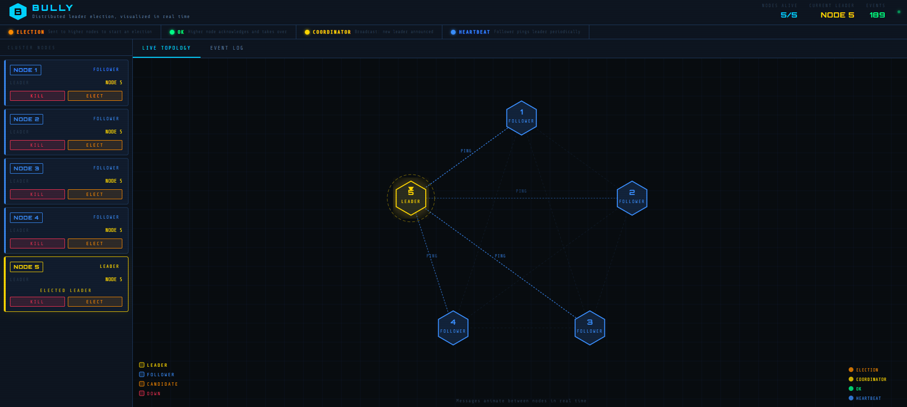

# BULLY: Distributed Leader Election Simulator



BULLY is an interactive simulator of the Bully algorithm for distributed leader
election. It runs a cluster of five independent nodes in Docker, each a small
Flask service that speaks the real protocol over HTTP: heartbeats to the leader,
election messages to higher-numbered nodes, and coordinator broadcasts. A web
dashboard shows the cluster live, so you can watch the nodes elect a leader on
startup, kill the leader or any other node from the UI, and watch the survivors
detect the failure and run a new election.

## Team

Hassan Fasseh and Nada Sadraoui ([github.com/nadasd](https://github.com/nadasd)).
This is a course project and we worked on it together.

## Quick start

### Requirements

- Docker Engine 24 or newer
- The Docker Compose v2 plugin (`docker compose`, not the old `docker-compose`)

### Run

```bash
git clone <this-repo-url>
cd bully-election
docker compose up --build
```

Then open http://localhost:3000.

The dashboard loads right away. Within about 3 to 5 seconds the five nodes run
their startup election, and Node 5 (the highest ID) becomes leader.

Stop everything with `docker compose down`.

## How the Bully algorithm works

Every node knows the full list of node IDs. The rule is simple: the live node
with the highest ID is always the leader.

1. Each follower periodically sends a heartbeat to the current leader.
2. If the leader does not answer, the follower starts an election.
3. It sends an election message to every node with a higher ID than its own.
4. If at least one higher node answers, this node drops out and waits for the
   result. The higher node that answered runs its own election in turn.
5. If no higher node answers, this node makes itself leader and sends a
   coordinator message to everyone else.
6. Any node that receives a coordinator message records the sender as the leader.

### Why "bully"?

A higher-ID node always wins, so it effectively pushes every lower-ID node out of
the contest. The highest live ID bullies its way to leadership.

## Node API

Each node container serves these endpoints on port 5000. The dashboard reaches
them through the nginx proxy at `/api/node<N>/...`.

| Endpoint | Method | Purpose |
|---|---|---|
| `/status` | GET | Node ID, current leader, role, alive flag, recent log lines |
| `/events` | GET | Server-Sent Events stream of message activity, used for the packet animation |
| `/election` | POST | Receive an election message from a lower-ID node |
| `/coordinator` | POST | Receive a "node X is the new leader" announcement |
| `/ok` | POST | Present for protocol completeness; this build uses the HTTP 200 on `/election` as the acknowledgement |
| `/shutdown` | POST | Simulate a crash (node stops answering until recovered) |
| `/recover` | POST | Bring a crashed node back online as a follower |
| `/trigger-election` | POST | Manually start an election from this node |

## Demo scenarios

### 1. Kill the leader

1. Wait for Node 5 to become leader (gold ring in the graph).
2. Click KILL on Node 5.
3. Node 5 goes to DOWN. Within a few seconds the other nodes miss a heartbeat
   and an election runs. Node 4 wins and becomes leader.
4. Click RECOVER on Node 5. It comes back as a follower. Its next heartbeat finds
   Node 4 healthy, so it stays a follower rather than forcing itself back in.

### 2. Cascade failures

1. Kill Node 5, Node 4 becomes leader.
2. Kill Node 4, Node 3 becomes leader.
3. Kill Node 3, Node 2 becomes leader.
4. Kill Node 2, Node 1 is the last node standing and becomes leader.
5. Recover the nodes one at a time. Each rejoins as a follower under Node 1 until
   you recover a node with a higher ID, which then wins the next election.

### 3. Manual election

1. Click ELECT on any follower.
2. That node starts an election immediately.
3. The highest-ID live node wins, which may or may not be the node you clicked.

## Dashboard

### Header

Live indicator, count of nodes alive, the current leader, and a running total of
events seen.

### Cluster nodes (left)

One card per node, showing its ID, its role (LEADER, FOLLOWER, CANDIDATE, or
DOWN), and which node it currently believes is the leader. Buttons:

- KILL: stop the node
- ELECT: start an election from this node
- RECOVER: bring a stopped node back

The leader card is highlighted and labelled ELECTED LEADER.

### Topology (right)

A D3-rendered graph with the nodes on a fixed circle, coloured by role. The
leader has a gold ring and glow, a node running an election has a pulsing ring,
and a stopped node is dimmed with a red X. Message packets animate along the
edges as elections and heartbeats happen. A tab switches this panel to the event
log.

### Event log

Every node event in reverse chronological order, coloured by kind: leader
elected, election started, leader failure detected, node recovered, coordinator
broadcast.

## Configuration

Set on the node services in `docker-compose.yml`:

| Variable | Default | Meaning |
|---|---|---|
| `NODE_ID` | required | Unique integer ID for the node |
| `ALL_NODES` | `1,2,3,4,5` | Comma-separated list of every node ID in the cluster |
| `HEARTBEAT_INTERVAL` | `3` | Seconds between heartbeats |
| `REQUEST_TIMEOUT` | `2` | HTTP timeout in seconds for node-to-node calls |
| `MAX_LATENCY_MS` | `150` | Upper bound on the random delay added to each simulated message |

The frontend reads one value, in `frontend/.env` (copy it from
`frontend/.env.example`):

| Variable | Default | Meaning |
|---|---|---|
| `VITE_NODE_COUNT` | `5` | How many nodes the dashboard polls |

## Adding more nodes

The nginx proxy matches `/api/node<N>/` for any N, so only two files change:

1. In `docker-compose.yml`, add a service (for example `node6`) that extends
   `*node-common` and sets `NODE_ID: "6"`, then widen `ALL_NODES` to include the
   new ID on every node.
2. In `frontend/.env`, set `VITE_NODE_COUNT` to the new count.

Then `docker compose up --build`.

## Limitations

This is a teaching simulator, not a production coordination service. Known gaps,
each a reasonable next step rather than a bug:

- **Failure detection is timeout-based.** A slow node or a slow network can look
  like a crash and trigger an unnecessary election. There is no separate
  suspicion or phi-accrual mechanism.
- **No handling of lost messages.** Election and coordinator messages are plain
  HTTP calls. A dropped coordinator message can leave a node believing in an old
  leader until its next heartbeat cycle corrects it. There are retries on the
  election probe only.
- **No split-brain protection.** There is no quorum or fencing. A network
  partition can leave two nodes each acting as leader of their side until the
  partition heals.
- **No persistence.** Each node keeps its state in memory. Restarting a node
  container resets it, and there is no log or snapshot of past elections beyond
  the in-memory event history the dashboard shows.

## Project structure

```
node/
  app.py             Flask service: Bully protocol, heartbeat loop, SSE event stream
  requirements.txt
  Dockerfile
frontend/
  src/
    App.jsx          dashboard: node cards, controls, event log, polling
    NetworkGraph.jsx  D3 topology graph and packet animation
    App.css          styling
    index.css
    main.jsx
  index.html
  vite.config.js
  nginx.conf         reverse proxy: /api/node<N>/* to that node container
  .env.example
  Dockerfile
docker-compose.yml   five node services plus the frontend
```

## License

MIT, see [LICENSE](LICENSE). Copyright 2026 Hassan Fasseh and Nada Sadraoui.
